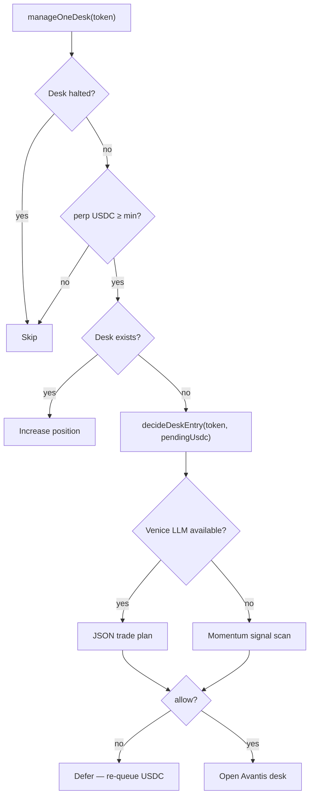

Unlike Fission (where registration tied a token to an underlying like SOL-PERP), pumperp desks are opened by an **agent** that picks live market structure per token.

## Decision flow



## Two-tier agent (`decideDeskEntry`)

Located in `backend/src/services/agent.ts`.

### 1. Venice LLM (primary)

When `VENICE_AGENT_ENABLED=true` (default) and a Venice API key resolves (`VENICE_API_KEY` or auto-mint via `VENICE_AUTO_MINT_KEY`):

- Sends Pyth/momentum snapshot + pending USDC to Venice chat completions
- Expects JSON: `{ allow, market, side, leverage, reason }`
- Markets constrained to `ETH` / `BTC`; leverage capped by Avantis + `RISK.leverage`
- DIEM fee slice funds the intelligence stack — agent decisions are the operational payoff of that leg

### 2. Signal engine (fallback)

If Venice is disabled, unreachable, or returns bad JSON:

1. For each market in `['ETH', 'BTC']`
2. Fetch signal from `market-signal.ts` (Pyth Hermes + rolling samples)
3. Evaluate long/short via `evaluateEntry`
4. Rank by `|momentumPct|`, pick best candidate

When `SIGNAL.enabled === false` ("full degen"):

- Opens **long ETH** at max leverage — no filter

## Signal parameters

| Config | Default | Meaning |
| --- | --- | --- |
| `SIGNAL.entryMomentumPct` | 0.0015 | Min \|momentum\| to enter |
| `SIGNAL.maxVolatilityPct` | 0.03 | Skip if vol too high |
| `SIGNAL.requireActiveSession` | false | Restrict to active trading session |
| `SIGNAL.momentumLookbackMs` | 900000 | 15 min sample window |
| `VENICE_AGENT_ENABLED` | true | Try LLM before signals |

## Leverage

```typescript
leverage = Math.min(config.RISK.leverage, config.AVANTIS_MAX_LEVERAGE, avantisPairCap)
```

## Registry vs desk

`ProtocolRegistry` stores `underlying`, `isLong`, `leverage` at enroll time for **display/indexing**. The desk agent chooses live market/side at open — registry fields are not binding.
