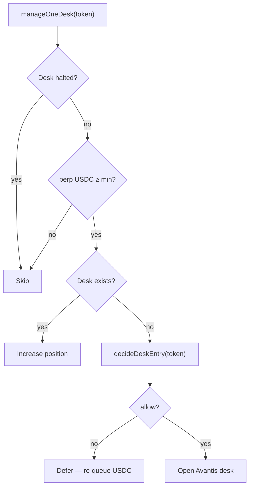

Unlike Fission (where registration tied a token to an underlying like SOL-PERP), pumperp desks are opened by an **agent** that reads live market structure.

## Decision flow



## `decideDeskEntry`

Located in `backend/src/services/agent.ts`.

When `SIGNAL.enabled === true` (default):

1. For each market in `['ETH', 'BTC']`
2. Fetch signal from `market-signal.ts` (Pyth Hermes + rolling samples)
3. Evaluate long and short entry via `evaluateEntry`
4. Rank candidates by `|momentumPct|`
5. Return best `(market, side, leverage)` or defer with reason

When `SIGNAL.enabled === false` ("full degen"):

- Opens **long ETH** at max leverage immediately — no momentum filter

## Signal parameters

| Config | Default | Meaning |
| --- | --- | --- |
| `SIGNAL.entryMomentumPct` | 0.0015 | Min \|momentum\| to enter |
| `SIGNAL.maxVolatilityPct` | 0.03 | Skip if vol too high |
| `SIGNAL.requireActiveSession` | false | Restrict to active trading session |
| `SIGNAL.momentumLookbackMs` | 900000 | 15 min sample window |

## Leverage

```typescript
leverage = Math.min(config.RISK.leverage, config.AVANTIS_MAX_LEVERAGE) // default 75
```

Higher leverage reduces collateral needed to hit Avantis min notional — but increases liquidation speed.

## Registry vs desk

`ProtocolRegistry` stores `underlying`, `isLong`, `leverage` at enroll time. These fields serve **display and indexing**; the **desk agent** chooses live market/side when opening unless you disable signals and rely on defaults.

If product requirements change to **lock** desk direction at launch, that would be an explicit design change in `desk-manager.ts` — not current behavior.
