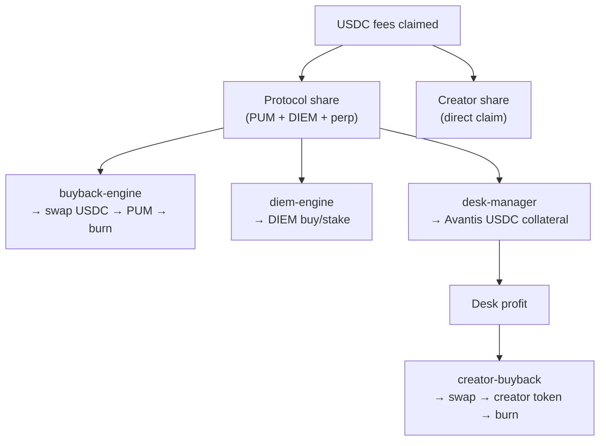

Every enrolled token has a **`TokenRewardSplit`** — basis points that must sum to **10 000 (100%)**.

## Split table

| Leg | Default | Config key | Destination |
| --- | ---: | --- | --- |
| **PUM** | 5% | `PUM_REWARD_BPS` (fixed) | PUM buyback & burn |
| **DIEM** | 28.5% | `diemBps` / `diemPct` | DIEM endowment (Venice intelligence token) |
| **Perp agent** | 57% | `perpBps` / `perpPct` | Per-token Avantis desk collateral |
| **Creator** | 9.5% | `creatorBps` / `creatorPct` | Creator wallet (claim on Clanker) |

Creators configure the **last three** at launch; they must sum to **95%**. PUM is always **5%**.

```typescript
// config.ts — default user-configurable split
DEFAULT_REWARD_SPLIT: {
  pumBps: 500,
  diemBps: 2850,
  perpBps: 5700,
  creatorBps: 950,
}
```

## Claim cycle

The **fee claimer** (`claimPooledFeesCycle`):

1. Round-robin batch of enrolled tokens (`CLAIM_BATCH_SIZE`, default 25)
2. `collectRewards` + `claim` USDC from Clanker FeeLocker
3. Attribute USDC per token
4. `splitProtocolUsdc` on the **protocol share** (PUM + DIEM + perp):

```
pumUsdc  = usdc × (pumBps / (pumBps + diemBps + perpBps))
diemUsdc = usdc × (diemBps / …)
perpUsdc = usdc × (perpBps / …)
```

5. Accrue to in-memory accumulators (`addTokenRewardAllocation`)

**Creator USDC** never passes through the engine — it sits in FeeLocker for the creator to claim via Clanker.

## Where each leg goes



## Fission 70/30 vs pumperp

Historical Fission docs describe a simple **70% perps / 30% protocol token burn**.

pumperp generalizes this:

- **PUM tithe (5%)** ≈ network tax on every launch (was 30% in Fission, but only of *protocol* flow)
- **Perp slice** ≈ Fission's 70% desk leg (now per-token, agent-managed)
- **DIEM + creator** ≈ new legs for intelligence endowment and optional creator cash

`config.FEE_SPLIT` (`positionFund: 0.7, buyback: 0.3`) is **deprecated** — the live path is `TokenRewardSplit` per token.

## Validation

`buildRewardSplit` rejects negative bps and enforces:

```
diemBps + perpBps + creatorBps === 10000 - PUM_REWARD_BPS  // 9500
```

API accepts either raw bps in `rewardSplit` or whole-percent shortcuts (`diemPct`, `perpPct`, `creatorPct`).
