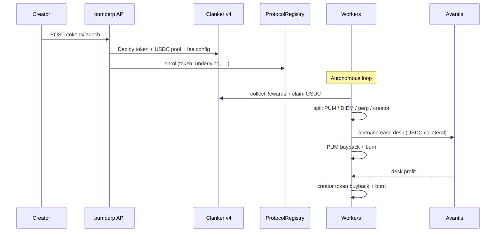

pumperp collapses what was **two steps on Solana Fission** (Pump.fun launch, then register) into **one Clanker deploy** with fee routing configured at creation time.

## Three phases

| Phase | Who | What happens |
| --- | --- | --- |
| **Launch** | Creator | Deploy Clanker token via pumperp; pick fee split; token enrolled in `ProtocolRegistry` |
| **Accrue** | Traders | Volume generates LP fees in USDC; protocol and creator shares accumulate in Clanker FeeLocker |
| **Engine** | Protocol wallet | Workers claim, split, open/manage Avantis desks, execute buybacks and burns |

## System flow

## Solana Fission vs pumperp

**Fission (original):**

1. Launch on Pump.fun with 100% fees → protocol wallet
2. Register mint with Fission (onchain verification)
3. Engine: 70% Jupiter perps, 30% FISSION burn

**pumperp:**

1. Launch on Clanker via pumperp (fee recipients + registry enroll in one flow)
2. Engine: configurable split with **5% PUM** fixed; perp slice funds **per-token desks**; profits burn **creator token** and **PUM**

## What creators configure at launch

- **Token metadata** — name, symbol, image, socials
- **Reward split** — how the non-PUM 95% divides across DIEM, perp-agent, and creator (must sum to 95%)
- **Optional creator buy** — initial USDC purchase of your token (no vault)

Desk **market and direction** are **not** fixed at launch. The perp agent scans ETH/BTC momentum and opens the desk on the strongest signal (see [Agents & signals](/engine/agents-and-signals)).

## Next

- [Launch flow](/how-it-works/launch) — API fields and Clanker fee config
- [Fee routing](/how-it-works/fee-routing) — PUM, DIEM, perp-agent, creator legs
