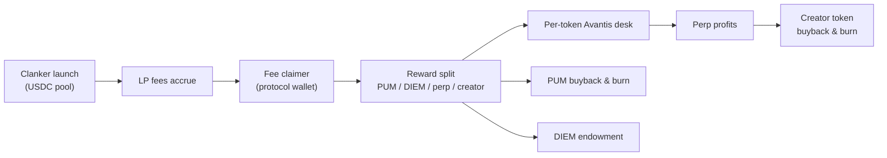

pumperp is a **Base-native fork of the [Fission](https://github.com/FissionDotFunSOL/fission) model**: creator LP fees from Clanker tokens feed an autonomous engine that runs Avantis perpetual desks and buyback-and-burn loops — no vaults, no manual treasury.

Where Fission on Solana routes Pump.fun fees into Jupiter Perps with a fixed 70/30 split, pumperp on Base deploys via **Clanker v4** (USDC pool, dynamic fee tier) and routes fees through a **four-way split**: fixed **5% PUM** tithe plus your allocation of **DIEM**, **perp-agent**, and **creator USDC**.

## Quick links

- [Philosophy](/philosophy) — why the Fission flywheel, adapted for Base
- [How it works](/how-it-works) — launch → claim → desk → buyback
- [Architecture](/overview/architecture) — frontend, backend workers, onchain registry
- [PUM tokenomics](/overview/tokenomics) — who holds PUM, tithe, burns
- [Workers](/engine/workers) — scheduler, fee claimer, desk manager, buyback engines
- [API reference](/api/reference) — `/api/v1` REST surface
- [Deployment](/operations/deployment) — env vars and deploy order

## Mental model

## Stack at a glance

| Layer | Technology |
| --- | --- |
| Chain | Base mainnet |
| Token launch | Clanker SDK v4, Uniswap v4 USDC pool |
| Perps | Avantis (USDC collateral, tx-builder API) |
| Backend | Express + viem workers |
| Frontend | Vite, vanilla JS |
| Onchain registry | `ProtocolRegistry.sol` |
| Persistence | Registry onchain; engine accumulators in memory |

## Risk

Avantis desks use high leverage (up to 75×). Liquidation is real. The protocol is experimental and unaudited. See [Security & risk](/operations/security).
