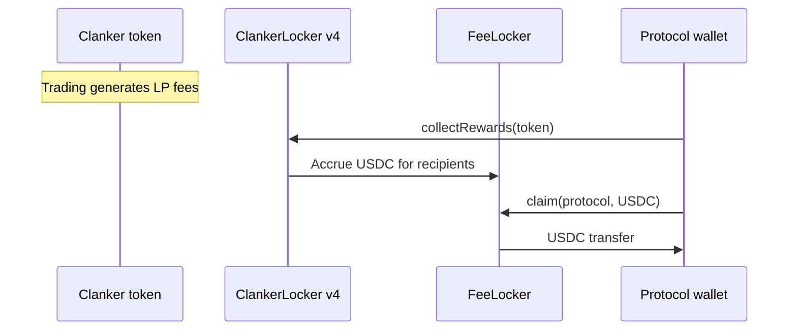

pumperp launches tokens through **Clanker SDK v4** on Base — replacing Fission's Pump.fun integration entirely.

## Fee pipeline

## Key addresses

Configured in `backend/src/config.ts` (override via env):

| Contract | Env override |
| --- | --- |
| `CLANKER_LOCKER_V4` | `CLANKER_LOCKER_V4` |
| `CLANKER_FEE_LOCKER_ADDRESS` | `CLANKER_FEE_LOCKER_ADDRESS` |
| USDC | `0x833589fCD6eDb6E08f4c7C32D4f71b54bdA02913` |

Never hardcode addresses in docs without checking `config.ts` — use env for deployments.

## Deploy

`launchToken` uses:

- `Clanker` from `clanker-sdk/v4`
- `FEE_CONFIGS` / dynamic fee tier
- `getTickFromMarketCapUSDC` for initial pool tick
- Protocol + creator recipients in rewards config

## Claims

`claimPooledFees(tokens[])`:

1. For each token: `collectRewards` on locker
2. Read `availableFees(protocol, USDC)`
3. `claim` if above dust threshold
4. Return `{ txHash, usdcClaimed, perToken }`

Batch size limited by `CLAIM_BATCH_SIZE` to keep gas predictable.

## vs Pump.fun (Fission)

| Pump.fun | Clanker v4 |
| --- | --- |
| SOL fees | USDC fees |
| Sharing config PDA verification | Recipients at SDK deploy |
| Separate admin revoke check | Clanker ownership model |

## Deploy auth

Deploy is **fully onchain**: `clanker-sdk/v4` + protocol wallet via viem. There is **no Clanker REST API key** in the live launch path.

Optional: `PINATA_JWT` to pin `image` URLs to IPFS before deploy (`backend/src/services/ipfs.ts`).
