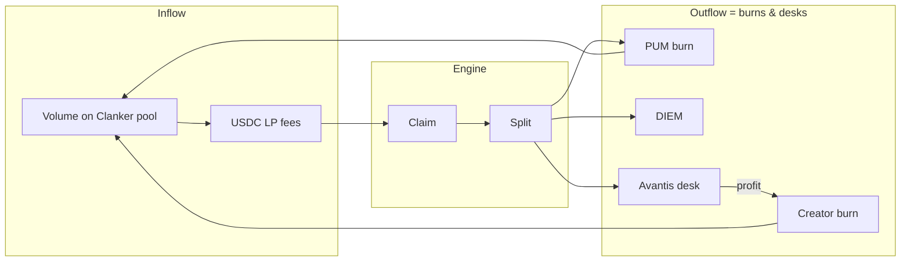

The **Fission flywheel** is a closed loop: external trading activity funds an engine whose outputs are **token burns**, not treasury accumulation.

## Loop diagram

## Two burn surfaces

| Burn target | Funded by | Worker |
| --- | --- | --- |
| **PUM** (protocol token) | PUM slice of every fee claim | `buyback-engine` |
| **Creator token** | Desk profits attributed to that token | `creator-buyback` |

Fission on Solana had an analogous split: **30% FISSION burn** on every claim, **70% perps** with profits returning to the **derivative token** burn.

pumperp separates protocol upside (**PUM tithe on all launches**) from creator upside (**your desk's profits → your token**).

## Amplification

Fees enter the desk as **USDC collateral × leverage** (up to 75× on Avantis). A $10 perp allocation at 75× controls ~$750 notional. A 1% favorable move ≈ $7.50 profit — larger than the fee that funded it.

This is the **leveraged amplification** marketed on pumperp.com — and the source of **liquidation risk** when moves go the wrong way.

## What resets on a bad trade

| Event | Effect on flywheel |
| --- | --- |
| Desk liquidation | That token's collateral is lost; new fees fund the next open |
| Losing desk (no profit) | No creator buyback that cycle; PUM/DIEM legs unaffected |
| Protocol pause | Registry `pause(token)` removes token from active claim batch |

The flywheel **does not stop** when one desk blows up — unless circuit breakers halt desks globally (see [Risk](/engine/risk)).

## Network effect

Every launch pays **5% to PUM** regardless of that token's perp performance. More tokens → more aggregate PUM buy pressure — the protocol token benefits from ecosystem growth even when individual creator tokens struggle.

See [PUM tokenomics](/overview/tokenomics) for holder roles, supply mechanics, and what the protocol does *not* allocate.

## Honest limits

- Past buybacks do not predict future desk PnL
- Creator cash leg (`creatorBps`) is **not** part of the flywheel — it's direct USDC to the creator wallet
- Engine state is in-memory; extended downtime may delay allocations until the next claim cycle
