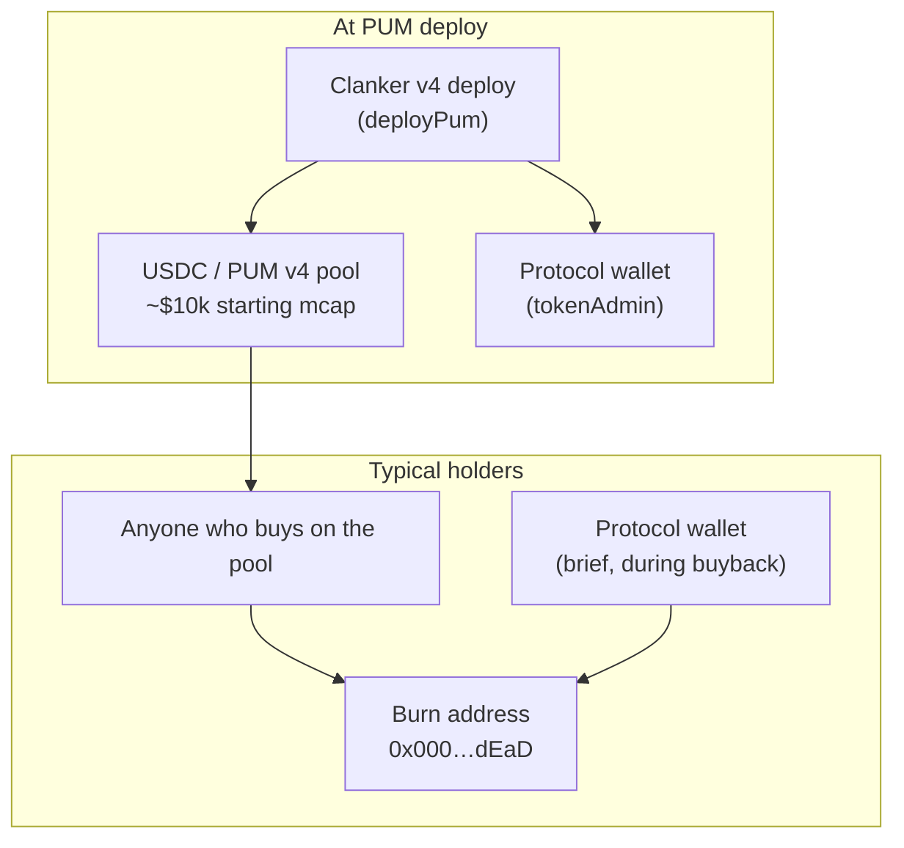
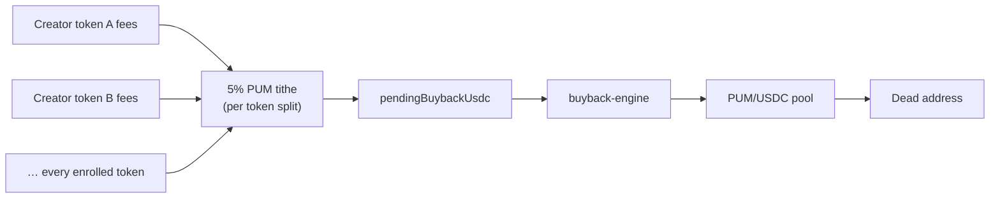

**PUM** is the pumperp protocol token — deployed once on Base via **Clanker v4**, same infrastructure as creator tokens. It is not a separate ERC-20 mint; it is a Clanker token with a USDC Uniswap v4 pool and onchain fee recipients set at deploy.

This page answers: **who holds PUM today**, **how supply changes**, and **where buy pressure comes from**.

## Roles at a glance

| Actor | Relationship to PUM | Holds PUM long-term? |
| --- | --- | --- |
| **Market traders / LPs** | Buy and sell on the Clanker USDC pool | Yes — circulating supply |
| **Burn address** | Receives all engine buyback burns | Yes — permanently locked (`0x…dEaD`) |
| **Protocol operator wallet** | `tokenAdmin`, signs engine txs | Transient only (swap → burn) |
| **Creators** | Launch tokens that fund the 5% tithe | No special PUM allocation |
| **Team / treasury / investors** | — | **No coded allocation** in the protocol |

There is **no vault**, **no premine script**, and **no vesting contract** in the pumperp codebase. Initial supply follows the standard Clanker launch path: tokens live in the v4 pool at deploy (~**$10k** starting market cap for PUM), and anyone can acquire PUM by trading against USDC.

## Who holds PUM after deploy



### 1. Market participants (circulating supply)

Anyone who purchases PUM on the **PUM/USDC Clanker pool** holds circulating supply. There is no separate “private sale” path in the protocol — acquisition is **onchain market buy** (or receiving a transfer from someone who bought).

### 2. Burn address (deflationary sink)

The buyback engine does not destroy tokens via a burn opcode. It **transfers PUM to the dead address**:

```typescript
// config.ts
DEAD_ADDRESS: '0x000000000000000000000000000000000000dEaD'
```

All PUM routed through `buyback-engine` ends here. This balance is **not recoverable** and reduces effective circulating supply.

Track burns via `GET /api/v1/buybacks` (protocol-token history) and onchain transfers to the dead address.

### 3. Protocol operator wallet

The wallet derived from `PROTOCOL_PRIVATE_KEY` is:

- **`tokenAdmin`** on the PUM Clanker deploy
- **100% recipient** of PUM’s **own** LP trading fees (see below)
- **Signer** for fee claims, desk txs, and buybacks

It is **not** designed as a long-term PUM treasury. During a buyback cycle it may briefly hold PUM between `swapUsdcForToken` and `burnTokens`, then sends the full balance to the dead address.

Operational balances on this wallet are **USDC and ETH** for gas and Avantis collateral — not a strategic PUM stash.

### 4. Creators and enrolled tokens

Creator tokens launched through pumperp are **separate** ERC-20s. Creators do **not** receive a PUM grant at launch.

Their connection to PUM is economic, not allocative: every enrolled token pays a **5% PUM tithe** on LP fees (see [Fee routing](/how-it-works/fee-routing)), which funds market buybacks of PUM across the whole ecosystem.

## PUM deploy configuration

PUM is deployed by the operator script `backend/scripts/deploy-pum.ts` → `deployPum()`:

| Setting | Value | Meaning |
| --- | --- | --- |
| `tokenAdmin` | Protocol wallet | Clanker admin for PUM |
| Fee recipients | Protocol **100%** (10 000 bps) | All PUM pool LP fees → protocol wallet |
| Paired token | USDC | Same as creator tokens |
| Pool | Uniswap v4 via Clanker | Buyback routing uses this pool |
| Starting mcap | ~$10k USDC | `usdcPoolConfig(10_000)` |
| Registry enroll | **No** | PUM is not an “enrolled” engine token |

PUM is **not** listed in `ProtocolRegistry.sol`. The engine’s fee-claimer batch only processes **enrolled creator tokens**. PUM does not pay the 5% tithe to itself — it is the **beneficiary** of tithes from other tokens.

## How PUM supply changes (value accrual)

PUM has **no inflation schedule** in the protocol. Supply decreases when the engine burns; it increases only via the Clanker token’s normal mint rules (if any — outside pumperp’s control).

### The 5% network tithe (primary buy pressure)

Every **enrolled creator token** carries a fixed **`PUM_REWARD_BPS = 500` (5%)** slice of LP fees. At launch, creators configure the other **95%** across DIEM, perp-agent, and creator USDC.

Flow:

1. **Fee claimer** claims USDC from Clanker FeeLocker (per enrolled token)
2. **`splitProtocolUsdc`** allocates the protocol share into PUM / DIEM / perp legs
3. PUM leg accrues to **`pendingBuybackUsdc`** (in-memory)
4. **`buyback-engine`** swaps USDC → PUM via Uniswap (v3 USDC→WETH, v4 WETH→PUM)
5. Full PUM balance is **transferred to the dead address**



**More launches → more fee volume → more aggregate PUM buy pressure**, even when individual creator desks lose money. That network effect is intentional (see [The flywheel](/overview/flywheel)).

Default launch split (including the fixed PUM leg) matches PUM’s own reference profile:

```typescript
DEFAULT_REWARD_SPLIT: {
  pumBps: 500,    // 5%  — fixed
  diemBps: 2850,  // 28.5%
  perpBps: 5700,  // 57%
  creatorBps: 950 // 9.5%
}
```

### PUM’s own pool fees

Trading on the **PUM/USDC** pool generates LP fees. At deploy, **100%** of those fees are assigned to the **protocol wallet** on Clanker — there is no external creator share.

Those fees arrive as **USDC** in FeeLocker. The live engine does **not** automatically claim PUM’s self-fees in the enrolled-token batch (PUM is not enrolled). The operator may claim them manually; they are **not** part of the documented 5% tithe loop unless separately wired.

### What does *not* mint or allocate PUM

| Mechanism | PUM effect |
| --- | --- |
| Perp desk profits | Burn **creator token**, not PUM |
| DIEM leg | Buys/stakes **DIEM**, not PUM |
| Creator USDC leg | Cash to creator wallet |
| Desk liquidation | Loses USDC collateral; no PUM mint |

## PUM vs creator tokens

| | **PUM** | **Creator token** |
| --- | --- | --- |
| Purpose | Protocol-wide asset; tithe beneficiary | Per-launch meme/trade token |
| Deploy | Once, by operator | Each creator via `/tokens/launch` |
| Fee share from its own pool | 100% → protocol wallet | Split per `TokenRewardSplit` |
| Engine enrollment | No | Yes (`ProtocolRegistry`) |
| Buyback target | **Yes** (5% tithe from all others) | **Yes** (from its desk profits only) |
| Burn funded by | All enrolled tokens’ PUM leg | Its own Avantis desk PnL |

## Fission comparison

Historical Fission on Solana burned **30% of every fee claim** into the FISSION token.

pumperp uses a **5% fixed tithe** on **every launch’s LP fees**, plus separate legs for DIEM, perp capital, and optional creator cash. The tithe is smaller per token but scales with **ecosystem breadth** (many enrolled tokens).

## Transparency

| Data | Where |
| --- | --- |
| PUM contract | `PROTOCOL_TOKEN_ADDRESS` / site health endpoint |
| Burn history | `GET /api/v1/buybacks` |
| Activity feed | `GET /api/v1/activity` (`pum-buyback` events) |
| Supply & holders | Base block explorer (ERC-20 total supply, holder list) |
| Dead-address balance | Explorer: transfers to `0x000000000000000000000000000000000000dEaD` |

## Summary

- **Circulating PUM** — held by anyone who bought on the Clanker pool (no protocol premine in code).
- **Burned PUM** — accumulates at the dead address via automated buybacks.
- **Protocol wallet** — admin and fee recipient for PUM’s own pool; executes burns but is not a long-term holder.
- **Buy pressure** — continuous **5% USDC tithe** from every enrolled creator token, swapped to PUM and burned.
- **No team allocation** — documented in code; any off-protocol holdings are outside this repo’s guarantees.

For fee split mechanics, see [Fee routing](/how-it-works/fee-routing). For deploy steps, see [Deployment](/operations/deployment).
